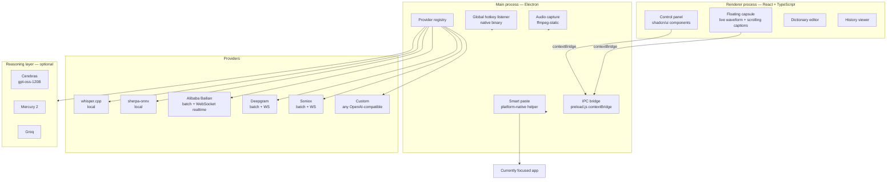

<p align="center">
  <picture>
    <source media="(prefers-color-scheme: dark)" srcset="src/assets/icon.png" />
    
  </picture>
</p>

<div align="center">

# Mouthpiece

 

**Cross-platform desktop dictation — BYOK by default, fully local capable.**

Press the hotkey → speak → text is pasted at your cursor.

[](LICENSE)
[](https://github.com/NotWizard/Mouthpiece/releases)
[](https://github.com/NotWizard/Mouthpiece/releases)
[](#-upstream--references)
[](SECURITY.md)

**Languages**: [中文](./README.md) · **[English](./README.en.md)**

[Install](#-install) · [Quick start](#-quick-start) · [Features](#-features) · [Architecture](#-architecture) · [BYOK](#-byok--what-it-means-here) · [Contributing](#-contributing)

</div>

---

> 📸 Screenshots auto-generated by GitHub Actions (cross-platform desktop capture is a planned v3.1 upgrade — `scripts/screenshot.js` + `.github/workflows/screenshot.yml`)

> A community continuation of **OpenWhispr** and **VoiceInk** — focused on paste fallback, a floating capsule with a real waveform, dictionary feedback, and explicit **BYOK** provider integrations (Alibaba Bailian / Deepgram / Soniox + OpenAI-compatible inference).

---

## ✨ Why Mouthpiece

- **🔌 BYOK by default** — you supply the API keys, you settle with the providers, you control the data flow. No subscription lock-in, no centralized SaaS.
- **🌍 One codebase, three platforms** — Electron packages macOS (.dmg/.zip), Windows (NSIS + portable .exe) and Linux (AppImage / .deb / .rpm / .tar.gz).
- **🎯 Floating capsule with a real waveform** — the recording indicator pulses with the actual microphone level, not a decorative animation.
- **🧠 Single-line scrolling captions** — text scrolls live while you speak, then smoothly switches to "processing…" when you stop.
- **🔁 Paste fallback that never steals your keys** — when the system decides direct injection is unsafe (terminal password prompts, 1Password, password fields), the text stays on the clipboard waiting for `⌘V` / `Ctrl+V`.
- **📒 A dictionary that learns** — corrections you accept flow back into the dictionary, so the same term is right the first time next round.
- **🪶 Three first-class cloud ASR providers** — Alibaba Bailian, Deepgram and Soniox each get their own card, their own key and their own batch/realtime toggle.

---

## 🚀 Install

### macOS

```bash
# Recommended: download the signed .dmg from Releases
open ~/Downloads/Mouthpiece-1.1.6-mac.dmg
# Drag Mouthpiece.app into /Applications and you're done
```

### Windows

```powershell
# Recommended: download the NSIS installer from Releases
# Double-click Mouthpiece-Setup-1.1.6.exe and follow the wizard
# Start-menu and desktop shortcuts are created automatically
```

### Linux

```bash
# AppImage (any distro)
chmod +x Mouthpiece-1.1.6-linux-x86_64.AppImage
./Mouthpiece-1.1.6-linux-x86_64.AppImage
# Or pick the .deb (Debian/Ubuntu), .rpm (Fedora/RHEL) or .tar.gz build
```

### Build from source (any platform)

```bash
git clone https://github.com/NotWizard/Mouthpiece.git
cd Mouthpiece
npm install
npm run dev          # dev mode with hot reload
```

> First launch asks for microphone permission; macOS additionally requests accessibility access, Windows/Linux request background input monitoring.

---

## ⚡ Quick start

### 30 seconds — launch the desktop app

Double-click the installed binary; the menu-bar icon lights up.

### 60 seconds — first transcription

1. Open the control panel from the tray icon.
2. **Set a global hotkey** (default `` ` `` backtick; change it to taste).
3. Under *Transcription*, pick a provider:
   - `Local · whisper.cpp` — fully offline, no key needed.
   - `Alibaba Bailian` — paste your DashScope API key; optionally enable realtime.
   - `Deepgram` / `Soniox` — same as above, paste the respective key.
4. *(Optional)* Under *Polish*, configure a Cerebras / Mercury / Groq OpenAI-compatible endpoint to post-process transcripts.
5. Press the hotkey → speak → release. The transcript lands at your cursor.

> Provider configuration examples: LOCAL_WHISPER_SETUP.md (pending, local), [`TROUBLESHOOTING.md`](TROUBLESHOOTING.md) (general), WINDOWS_TROUBLESHOOTING.md (pending).

---

## 📸 What it looks like

> ⚠️ Real screenshots are `[TODO]` placeholders; they will be replaced automatically once captures land in `.github/screenshots/`.

### Tray + floating capsule

<p align="center">
  <a href=".github/screenshots/tray-icon.png"></a>
  <a href=".github/screenshots/floating-capsule.png"></a>
</p>
<p align="center"><sub><em>[TODO: tray-icon.png] · [TODO: floating-capsule.png]</em></sub></p>

### Control panel + provider configuration

<p align="center">
  <a href=".github/screenshots/control-panel.png"></a>
  <a href=".github/screenshots/provider-cards.png"></a>
</p>
<p align="center"><sub><em>[TODO: control-panel.png] · [TODO: provider-cards.png]</em></sub></p>

### Dictionary + history

<p align="center">
  <a href=".github/screenshots/dictionary.png"></a>
  <a href=".github/screenshots/history.png"></a>
</p>
<p align="center"><sub><em>[TODO: dictionary.png] · [TODO: history.png]</em></sub></p>

---

## 🏗️ Architecture



**Main path**: hotkey press → audio capture → selected provider → (optional) reasoning polish → paste at the cursor.

---

## 📦 Features

### 🎙️ Transcription

- 🎤 **Local whisper.cpp** — fully offline transcription with multiple model tiers.
- 🧠 **Local sherpa-onnx** — alternative offline engine for low-memory machines.
- 🌐 **Alibaba Bailian** — first-class provider; batch (`qwen3-asr-flash`) + realtime (`qwen3-asr-flash-realtime`) modes.
- 🌐 **Deepgram** — first-class provider with an independent batch/realtime toggle.
- 🌐 **Soniox** — first-class provider with an independent batch/realtime toggle.
- 🔧 **Custom OpenAI-compatible** — bring any OpenAI-compatible endpoint; legacy Bailian configs auto-migrate on first launch.
- 🌐 **Multilingual ASR** — all providers accept ISO 639-1 language hints; auto-detected when unset.

### 🧠 Reasoning polish (optional post-processing)

- ⚡ **Cerebras `gpt-oss-120B`** — recommended default (~2,248 t/s).
- ⚡ **Mercury 2** — alternative low-latency realtime polish.
- ⚡ **Cerebras `Llama-3.1-8B`** — cheapest high-throughput option.
- ⚡ **Groq `Llama-3.3-70B`** — one key covers ASR + reasoning.
- 🔧 **Any OpenAI-compatible** — the settings page exposes an `enable_thinking` toggle.

### ⌨️ Dictation

- ⌨️ **Global hotkey** — press-and-hold or toggle; default `` ` ``, configurable.
- 🎯 **Floating capsule** — translucent panel with the real microphone waveform.
- 📜 **Streaming captions** — single-line continuous scroll, switching smoothly to `processing…` at the end.
- 🚦 **Voice-activity gating** — fewer phantom transcripts when the mic is open but nobody is talking.
- 📋 **Paste fallback** — when direct injection is unsafe, the text waits on the clipboard for your `⌘V` / `Ctrl+V`.

### 📚 Personalization

- 📖 **Custom dictionary** — source word → replacement, with bulk import.
- 🔁 **Continuous learning** — accepted corrections automatically feed back into the dictionary.
- 📜 **History** — searchable list of past transcriptions with app/window context, editable in place.
- 🎛️ **Per-scene profiles** — hotkey + provider combos per app / website (on the roadmap).

### 🌐 Platform & integrations

- 🖥️ **Three platforms** — macOS (Intel + Apple Silicon), Windows 10/11, Linux (AppImage / .deb / .rpm / .tar.gz).
- 🔌 **Local HTTP / WebSocket helper** — invisible per-platform background service for hotkeys + clipboard.
- 🔄 **Auto-update channel** — silent updates for packaged builds, with an install prompt in the control panel.
- 🌍 **i18next internationalization** — UI strings ship in `en` / `zh-Hans` / `es` / `fr` / `de` / `pt` / `it`.

---

## 🆚 Comparison

| Dimension | Mouthpiece 1.1.6 | Typeless (closed) | MacWhisper | Wispr Flow | OpenWhispr (upstream) |
|---|---|---|---|---|---|
| Three desktop platforms | ✅ macOS/Win/Linux | ❌ macOS | ✅ macOS | ❌ macOS | ✅ macOS/Win/Linux |
| BYOK | ✅ default | ❌ | ⚠️ partial | ❌ | ✅ |
| Alibaba Bailian (explicit) | ✅ first-class | ❌ | ❌ | ❌ | ⚠️ via Custom |
| Deepgram | ✅ first-class | ⚠️ | ✅ | ✅ | ✅ |
| Soniox | ✅ first-class | ❌ | ❌ | ❌ | ❌ |
| Local whisper.cpp | ✅ bundled binary | ❌ | ✅ | ❌ | ✅ |
| Local sherpa-onnx | ✅ | ❌ | ❌ | ❌ | ❌ |
| Open source | ✅ MIT | ❌ | ✅ | ❌ | ✅ |
| Paste fallback | ✅ explicit | ⚠️ | ⚠️ | ⚠️ | ⚠️ |
| Real microphone waveform | ✅ | ⚠️ | ⚠️ | ✅ | ⚠️ |

---

## 🔐 BYOK — what it means here

**Bring Your Own Key** is the default posture: every cloud provider requires you to paste your own API key. Mouthpiece itself never collects, holds or pays on your behalf.

- **Bring-your-own-channel mode (default)** — you supply keys for Alibaba Bailian / Deepgram / Soniox / Cerebras / Mercury / Groq / any OpenAI-compatible endpoint, and you settle directly with the provider.
- **Optional account mode (not default)** — enabled only if you build a compatible login + billing backend and point the app at it. No account is needed out of the box.

Example provider environment variables (used by the bundled Cerebras / Bailian paths and other compatible clients):

```bash
# Alibaba Bailian / DashScope (compatible mode)
DASHSCOPE_API_KEY=your_dashscope_key
DASHSCOPE_BASE_URL=https://dashscope.aliyuncs.com/compatible-mode/v1
# model: qwen3-asr-flash  (use qwen3-asr-flash-realtime for realtime)

# Cerebras (default reasoning)
OPENAI_API_KEY=your_cerebras_key
OPENAI_BASE_URL=https://api.cerebras.ai/v1
# model: gpt-oss-120b

# Mercury 2 (alternative reasoning)
MERCURY_API_KEY=your_mercury_key
MERCURY_BASE_URL=https://api.inceptionlabs.ai/v1
# model: mercury-2
```

---

## 🛠️ Build from source

```bash
git clone https://github.com/NotWizard/Mouthpiece.git
cd Mouthpiece
npm install
npm run dev               # dev mode
npm run build:renderer    # compile React assets only
npm run dist              # package for all platforms
```

| Platform | Build command | Artifacts |
|---|---|---|
| macOS (universal) | `npm run build:mac` | `dist/Mouthpiece-1.1.6-mac.dmg`, `.zip` |
| Windows | `npm run build:win` | `dist/Mouthpiece-Setup-1.1.6.exe`, portable `.exe` |
| Linux AppImage | `npm run build:linux:appimage` | `dist/Mouthpiece-1.1.6-linux-x86_64.AppImage` |
| Linux .deb | `npm run build:linux:deb` | `dist/Mouthpiece-1.1.6-linux-amd64.deb` |
| Linux .rpm | `npm run build:linux:rpm` | `dist/Mouthpiece-1.1.6-linux-x86_64.rpm` |
| Linux .tar.gz | `npm run build:linux:tar` | `dist/Mouthpiece-1.1.6-linux-x64.tar.gz` |

> Windows source-tree users can run `Mouthpiece-Launch.vbs` in `core/` (no console flash) or `Create-Mouthpiece-DesktopShortcut.ps1` (creates a desktop shortcut).

---

## 🗓️ Roadmap

- [x] **v1.1.0** — Bailian provider decoupled from `Custom + DashScope` (old configs auto-migrate at launch)
- [x] **v1.1.1** — Soniox provider card
- [x] **v1.1.2** — Deepgram provider card
- [x] **v1.1.3** — single-line continuous streaming captions
- [x] **v1.1.4** — voice-activity gating to cut phantom transcripts
- [x] **v1.1.5** — reasoning moved to the Electron main process (avoids renderer network-boundary issues)
- [x] **v1.1.6** — install prompt in the control panel + removal of the legacy `usage analytics` option
- [ ] **v1.2** — per-app / per-website dictation profiles
- [ ] **v1.3** — built-in post-processing prompt library for transcripts

> Per-feature plans live in `docs/plans/`.

---

## 🤝 Contributing

PRs welcome. Please read first:

- **Issues** — include OS, Mouthpiece version, and provider setup (BYOK key or local).
- **PRs** — align with the existing structure: cross-platform helpers in `core/`, provider implementations in `src/services/`, translations in `src/locales/`.
- **i18n** — run `npm run i18n:check` to keep locales consistent.
- **Releases** — run `npm run quality-check && npm run lint` before submitting.

This project follows the spirit of the [Contributor Covenant v2.1](https://www.contributor-covenant.org/version/2/1/code_of_conduct/).

---

## 🔒 Security

Report vulnerabilities privately — **do not open a public GitHub issue**. See [`SECURITY.md`](SECURITY.md) for the supported-version table, disclosure window and private contact channel.

Mouthpiece's security posture:

- **BYOK isolation** — provider keys live in the OS-native credential store (Keychain / Credential Manager / libsecret), never in the renderer's `process.env`.
- **Renderer hardening** — `contextIsolation: true`, `nodeIntegration: false`, `sandbox: true`; the renderer never sees raw keys.
- **Main-process proxying** — all cloud calls originate from the main process; the renderer has no direct network path to third-party ASR endpoints.
- **Electron Builder hardening** — `hardenedRuntime` + entitlements on macOS; silent NSIS install on Windows.

---

## ⚖️ Legal & risk disclosure

1. Provided under the **MIT License**, without warranty of any kind, express or implied.
2. When using cloud models, data is processed per the respective provider's policy — review their privacy and compliance terms yourself.
3. Speech-to-text and intelligent post-processing can make mistakes; always get human review for high-stakes legal, medical or financial use.
4. This project does not provide investment, medical or legal advice.

---

## 🪺 Upstream & references

- OpenWhispr repo: <https://github.com/OpenWhispr/openwhispr>
- VoiceInk repo: <https://github.com/le-soleil-se-couche/VoiceInk>
- Cerebras Cloud: <https://cloud.cerebras.ai>
- Cerebras inference docs: <https://inference-docs.cerebras.ai>
- Cerebras pricing: <https://www.cerebras.ai/pricing>
- Artificial Analysis (Cerebras): <https://artificialanalysis.ai/providers/cerebras>
- Alibaba Cloud Bailian console (DashScope compatible mode): <https://bailian.console.aliyun.com/>

---

## 📜 License

[MIT](LICENSE) — see [`LICENSE`](LICENSE) for the full text.

---

<div align="center">

<sub>📌 Mouthpiece is a community-maintained fork — not affiliated with Typeless, OpenWhispr's official services, or VoiceInk's commercial product. · <a href="https://github.com/NotWizard/Mouthpiece/issues">🐛 Report a bug</a> · <a href="https://github.com/NotWizard/Mouthpiece/discussions">💬 Discussions</a></sub>

</div>
