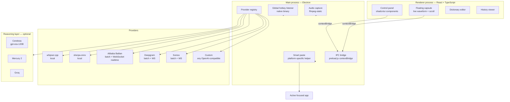

<p align="center">
  <picture>
    <source media="(prefers-color-scheme: dark)" srcset="src/assets/icon.png" />
    
  </picture>
</p>

<div align="center">

# Mouthpiece

**Cross-platform desktop dictation that keeps your hands off the keyboard — BYOK by default, fully local on demand.**

Hotkey → speak → text lands where your cursor was.

[](LICENSE)
[](https://github.com/NotWizard/Mouthpiece/releases)
[](https://github.com/NotWizard/Mouthpiece/releases)
[](#-upstream--references)
[](SECURITY.md)

**Languages**: [English](./README.md) · [中文](./README.zh.md)

[Install](#-install) · [Quick Start](#-quick-start) · [Features](#-features) · [Architecture](#-architecture) · [BYOK](#-byok--what-it-means-here) · [Contributing](#-contributing)

</div>

---

> A community continuation of **OpenWhispr** and **VoiceInk** — focused on reliable paste-fallback, a real waveform in the floating capsule, dictionary feed-back, and explicit **BYOK** provider integrations (Alibaba Bailian / Deepgram / Soniox + OpenAI-compatible reasoning).

---

## ✨ Why Mouthpiece

- **🔌 BYOK by default** — you supply the API key, you pay the provider, you keep the data flow under your control. No subscription, no hosted SaaS lock-in.
- **🌍 Three platforms, one codebase** — Electron shell packages for macOS (.dmg/.zip), Windows (NSIS + portable .exe), and Linux (AppImage / .deb / .rpm / .tar.gz).
- **🎯 Floating capsule with a real waveform** — the recording indicator pulses with your actual microphone level, not a stock animation.
- **🧠 Live streaming transcript** — single-line continuous scroll while speaking, smooth handoff into `Processing...` afterward.
- **🔁 Paste fall-back that doesn't fight you** — when the system judges pasting unsafe (Terminal password prompts, 1Password vaults, password fields), the text stays on the clipboard for `⌘V` / `Ctrl+V`.
- **📒 Dictionary that learns from corrections** — accepted edits feed back into the dictionary; the next session recognizes the term on the first try.
- **🪶 Three first-class cloud ASR providers** — Alibaba Bailian, Deepgram, and Soniox are independent cards with their own keys, models, and batch vs realtime toggles.

---

## 🚀 Install

### macOS

```bash
# Recommended: download the signed .dmg from Releases
open ~/Downloads/Mouthpiece-1.1.6-mac.dmg
# Drag Mouthpiece.app to /Applications as usual.
```

### Windows

```powershell
# Recommended: download the NSIS installer from Releases
# Double-click Mouthpiece-Setup-1.1.6.exe and follow the prompts.
# It will create Start Menu + Desktop shortcuts.
```

### Linux

```bash
# AppImage (any distro)
chmod +x Mouthpiece-1.1.6-linux-x86_64.AppImage
./Mouthpiece-1.1.6-linux-x86_64.AppImage
# Or: install the .deb (Debian/Ubuntu), .rpm (Fedora/RHEL), or .tar.gz archive.
```

### From source (any platform)

```bash
git clone https://github.com/NotWizard/Mouthpiece.git
cd Mouthpiece
npm install
npm run dev          # development with hot reload
```

> First run will prompt for microphone permission and Accessibility (macOS) / permission to run as background input monitor (Windows / Linux).

---

## ⚡ Quick Start

### 30 seconds — boot the desktop app

After installing the binary, double-click the app. The tray icon appears.

### 60 seconds — first transcription

1. Open the Control Panel from the tray icon.
2. **Set your hotkey** (default is `` ` `` — backtick; pick whatever suits your layout).
3. In **Transcription**, pick a provider:
   - `Local · whisper.cpp` — fully offline, no key needed.
   - `Alibaba Bailian` — paste a DashScope API key, optionally enable realtime.
   - `Deepgram` / `Soniox` — same flow, paste the relevant key.
4. *(Optional)* In **Reasoning**, set a Cerebras / Mercury / Groq OpenAI-compatible endpoint to polish transcripts.
5. Press the hotkey, speak, release. The transcript appears at your cursor.

> **Provider setup walkthroughs**: [`LOCAL_WHISPER_SETUP.md`](LOCAL_WHISPER_SETUP.md) (offline mode), [`TROUBLESHOOTING.md`](TROUBLESHOOTING.md) (general), [`WINDOWS_TROUBLESHOOTING.md`](WINDOWS_TROUBLESHOOTING.md).

---

## 📸 Visual Tour

> ⚠️ Real screenshots are queued as `[TODO]` placeholders. Until then, run the app and drop real PNGs into `.github/screenshots/` — placeholders will resolve automatically.

### Tray + floating capsule

<p align="center">
  <a href=".github/screenshots/tray-icon.png"></a>
  <a href=".github/screenshots/floating-capsule.png"></a>
</p>
<p align="center"><sub><em>[TODO: tray-icon.png] · [TODO: floating-capsule.png]</em></sub></p>

### Control panel + provider settings

<p align="center">
  <a href=".github/screenshots/control-panel.png"></a>
  <a href=".github/screenshots/provider-cards.png"></a>
</p>
<p align="center"><sub><em>[TODO: control-panel.png] · [TODO: provider-cards.png]</em></sub></p>

### Dictionary + history

<p align="center">
  <a href=".github/screenshots/dictionary.png"></a>
  <a href=".github/screenshots/history.png"></a>
</p>
<p align="center"><sub><em>[TODO: dictionary.png] · [TODO: history.png]</em></sub></p>

---

## 🏗️ Architecture



**Hot path**: hotkey press → audio capture → chosen provider → (optional) reasoning pass → paste at the previously focused cursor.

---

## 📦 Features

### 🎙️ Transcription

- 🎤 **Local whisper.cpp** — fully offline transcription, multiple model sizes.
- 🧠 **Local sherpa-onnx** — alternative offline engine optimized for low-memory hosts.
- 🌐 **Alibaba Bailian** — first-class provider; batch (`qwen3-asr-flash`) + realtime (`qwen3-asr-flash-realtime`) modes.
- 🌐 **Deepgram** — first-class provider with independent batch/realtime toggles.
- 🌐 **Soniox** — first-class provider with independent batch/realtime toggles.
- 🔧 **Custom OpenAI-compatible** — keep it for any other OpenAI-compatible endpoint; the Bailian legacy path is auto-migrated on first launch.
- 🌐 **Multi-language ASR** — language hint (ISO 639-1) supported across all providers; auto-detect when unset.

### 🧠 Reasoning (optional post-processing)

- ⚡ **Cerebras `gpt-oss-120B`** — default recommendation for short-text polish (~2,248 t/s).
- ⚡ **Mercury 2** — alternative low-latency live polisher.
- ⚡ **Cerebras `Llama-3.1-8B`** — lowest-cost high-throughput option.
- ⚡ **Groq `Llama-3.3-70B`** — single-key ASR + reasoning from one provider.
- 🔧 **Any OpenAI-compatible endpoint** — plug in your own; `enable_thinking` toggle surfaces in settings.

### ⌨️ Dictation

- ⌨️ **Global hotkey** — press-and-hold or toggle; default `` ` `` is configurable.
- 🎯 **Floating capsule** — translucent panel with live waveform tied to actual microphone level.
- 📜 **Streaming transcript** — single-line continuous scroll, hands off into `Processing...` cleanly.
- 🚦 **Voice-activity gate** — reduces false-positive transcripts when the mic is open but no speech yet.
- 📋 **Paste fall-back** — when direct injection is unsafe, the text lands on the clipboard for `⌘V` / `Ctrl+V`.

### 📚 Personalization

- 📖 **Custom dictionary** — per-term source → replacement; bulk import supported.
- 🔁 **Continuous learning** — accepted corrections feed back into the dictionary automatically.
- 📜 **History** — searchable list of past transcriptions, with edit-in-place and app/window context.
- 🎛️ **Profiles** — keep hotkey + provider combos per app or per website (coming roadmap).

### 🌐 Platform & integration

- 🖥️ **Three platforms** — macOS (Intel + Apple Silicon), Windows 10/11, and Linux (AppImage / .deb / .rpm / .tar.gz).
- 🔌 **Local HTTP / WebSocket helpers** — invisible background services for hotkey + clipboard on each platform.
- 🔄 **Auto-update channel** — packaged builds receive silent updates; the Control Panel surfaces install prompts.
- 🌍 **i18n via i18next** — UI strings ship in `en`, `zh-Hans`, `es`, `fr`, `de`, `pt`, `it`.

---

## 🆚 Comparison

| Dimension | Mouthpiece 1.1.6 | Typeless (closed) | MacWhisper | Wispr Flow | OpenWhispr (upstream) |
|---|---|---|---|---|---|
| Three-platform desktop | ✅ macOS/Win/Linux | ❌ macOS | ✅ macOS | ❌ macOS | ✅ macOS/Win/Linux |
| BYOK model | ✅ default | ❌ | ⚠️ partial | ❌ | ✅ |
| Alibaba Bailian (explicit) | ✅ first-class | ❌ | ❌ | ❌ | ⚠️ via Custom |
| Deepgram | ✅ first-class | ⚠️ | ✅ | ✅ | ✅ |
| Soniox | ✅ first-class | ❌ | ❌ | ❌ | ❌ |
| Local whisper.cpp | ✅ bundled binary | ❌ | ✅ | ❌ | ✅ |
| Local sherpa-onnx | ✅ | ❌ | ❌ | ❌ | ❌ |
| Open-source | ✅ MIT | ❌ | ✅ | ❌ | ✅ |
| Paste fall-back | ✅ explicit | ⚠️ | ⚠️ | ⚠️ | ⚠️ |
| Live waveform from real mic | ✅ | ⚠️ | ⚠️ | ✅ | ⚠️ |

---

## 🔐 BYOK — what it means here

**Bring Your Own Key** is the default posture: every cloud provider requires the user to paste their own API key. Mouthpiece itself does not bill, hold, or proxy payments.

- **Self-supplied model mode (default)** — you bring the API key for Alibaba Bailian / Deepgram / Soniox / Cerebras / Mercury / Groq / OpenAI-compatible endpoint, and you settle with that provider directly.
- **Optional hosted account mode** — only enabled if you point Mouthpiece at a self-hosted compatible auth + billing backend (see [BYOK / account mode spec](TROUBLESHOOTING.md)). Out of the box, no account system is required.

Sample provider environment variables (used by the bundled Cerebras / Bailian paths or external compatible clients):

```bash
# Alibaba Bailian / DashScope (compatible mode)
DASHSCOPE_API_KEY=your_dashscope_key
DASHSCOPE_BASE_URL=https://dashscope.aliyuncs.com/compatible-mode/v1
# Model: qwen3-asr-flash  (or qwen3-asr-flash-realtime for streaming)

# Cerebras (default reasoning)
OPENAI_API_KEY=your_cerebras_key
OPENAI_BASE_URL=https://api.cerebras.ai/v1
# Model: gpt-oss-120b

# Mercury 2 (alternative reasoning)
MERCURY_API_KEY=your_mercury_key
MERCURY_BASE_URL=https://api.inceptionlabs.ai/v1
# Model: mercury-2
```

---

## 🛠️ Build from source

```bash
git clone https://github.com/NotWizard/Mouthpiece.git
cd Mouthpiece
npm install
npm run dev               # live development
npm run build:renderer    # compile the React bundle only
npm run dist              # full multi-platform packaging
```

| Platform | Build command | Output |
|---|---|---|
| macOS (universal) | `npm run build:mac` | `dist/Mouthpiece-1.1.6-mac.dmg`, `.zip` |
| Windows | `npm run build:win` | `dist/Mouthpiece-Setup-1.1.6.exe`, portable `.exe` |
| Linux AppImage | `npm run build:linux:appimage` | `dist/Mouthpiece-1.1.6-linux-x86_64.AppImage` |
| Linux .deb | `npm run build:linux:deb` | `dist/Mouthpiece-1.1.6-linux-amd64.deb` |
| Linux .rpm | `npm run build:linux:rpm` | `dist/Mouthpiece-1.1.6-linux-x86_64.rpm` |
| Linux .tar.gz | `npm run build:linux:tar` | `dist/Mouthpiece-1.1.6-linux-x64.tar.gz` |

> For source-tree users on Windows, the `core/` directory ships `Mouthpiece-Launch.vbs` and `Create-Mouthpiece-DesktopShortcut.ps1` to skip the black `.bat` console flash and create a real desktop shortcut.

---

## 🗓️ Roadmap

- [x] **v1.1.0** — Bailian provider detached from the `Custom + DashScope` workaround (auto-migration on startup)
- [x] **v1.1.1** — Soniox provider card
- [x] **v1.1.2** — Deepgram provider card
- [x] **v1.1.3** — Streaming caption single-line continuous scroll
- [x] **v1.1.4** — Voice-activity gate to suppress false-positive transcripts
- [x] **v1.1.5** — Backend reasoning routed through Electron main process (avoids renderer networking edge cases)
- [x] **v1.1.6** — Control-panel install prompts + dropped legacy `usage analytics` opt-in
- [ ] **v1.2** — Per-app and per-website dictation profiles
- [ ] **v1.3** — Optional in-app transcribed-text transformation prompt library

> Per-feature plans are documented in `docs/plans/` (see [Project Notes section in this README](#-contributing)).

---

## 🤝 Contributing

Pull requests welcome. Start with:

- **Issues** — please include your OS, Mouthpiece version, and how the provider was configured (BYOK key set or local).
- **PRs** — match the existing structure: `core/` for cross-platform helpers, `src/services/` for provider implementations, `src/locales/` for translations.
- **i18n** — `npm run i18n:check` ensures parity across language bundles.
- **Release** — Run `npm run quality-check && npm run lint` before opening a PR.

This project follows the spirit of the [Contributor Covenant v2.1](https://www.contributor-covenant.org/version/2/1/code_of_conduct/).

---

## 🔒 Security

Found a vulnerability? **Do not** file a public issue. See [`SECURITY.md`](SECURITY.md) for the supported-versions table, the disclosure window, and a private contact channel.

Mouthpiece's threat posture:

- **BYOK isolation** — provider keys are stored in the OS-native secrets store (Keychain / Credential Manager / libsecret); not in `process.env` for the renderer.
- **Renderer hardening** — `contextIsolation: true`, `nodeIntegration: false`, `sandbox: true`; the renderer never gets raw key material.
- **Main-process proxy** — all cloud calls originate from the main process so the renderer never has direct network trust to third-party ASR endpoints.
- **Electron Builder hardening** — `hardenedRuntime` + entitlements on macOS; NSIS silent install on Windows.

---

## ⚖️ Legal & Risk Disclosure

1. This project is provided under the **MIT License** without any express or implied warranty.
2. When you use a cloud model, the data flows through that provider under their terms. Review their privacy and compliance policies yourself.
3. Speech-to-text and intelligent post-processing may produce errors. Do not use the output in legal, medical, or financial workflows without human review.
4. This project does not offer investment, medical, or legal advice.

---

## 🪺 Upstream & References

- OpenWhispr origin: <https://github.com/OpenWhispr/openwhispr>
- VoiceInk origin: <https://github.com/le-soleil-se-couche/VoiceInk>
- Cerebras Cloud: <https://cloud.cerebras.ai>
- Cerebras inference docs: <https://inference-docs.cerebras.ai>
- Cerebras pricing: <https://www.cerebras.ai/pricing>
- Artificial Analysis (Cerebras): <https://artificialanalysis.ai/providers/cerebras>
- Alibaba Bailian console (DashScope compatible mode): <https://bailian.console.aliyun.com/>

---

## 📜 License

[MIT](LICENSE) — see [`LICENSE`](LICENSE) for the full text.

---

<div align="center">

<sub>📌 Mouthpiece is a community-maintained fork — not affiliated with Typeless, OpenWhispr cloud services, or VoiceInk commercial offerings. · <a href="https://github.com/NotWizard/Mouthpiece/issues">🐛 Report a bug</a> · <a href="https://github.com/NotWizard/Mouthpiece/discussions">💬 Discuss</a></sub>

</div>
