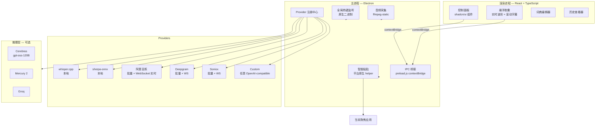

<p align="center">
  <picture>
    <source media="(prefers-color-scheme: dark)" srcset="src/assets/icon.png" />
    
  </picture>
</p>

<div align="center">

# Mouthpiece

**跨平台桌面听写工具 — 默认 BYOK，可全程本地运行。**

按下热键 → 说话 → 自动粘贴到光标处。

[](LICENSE)
[](https://github.com/NotWizard/Mouthpiece/releases)
[](https://github.com/NotWizard/Mouthpiece/releases)
[](#-upstream--references)
[](SECURITY.md)

**Languages**: [English](./README.md) · [中文](./README.en.md)

[安装](#-安装) · [快速开始](#-快速开始) · [功能](#-功能) · [架构](#-架构) · [BYOK](#-byok--这里的含义) · [贡献](#-贡献)

</div>

---

> 📸 Screenshots auto-generated by GitHub Actions（跨平台桌面截图 v3.1 升级计划中 — `scripts/screenshot.js` + `.github/workflows/screenshot.yml`）

> 社区对 **OpenWhispr** 与 **VoiceInk** 的延续 — 专注粘贴回退、悬浮胶囊的真实波形、词典回流、以及显式的 **BYOK** provider 集成（阿里百炼 / Deepgram / Soniox + OpenAI-compatible 推理）。

---

## ✨ 为什么选 Mouthpiece

- **🔌 BYOK 默认** — 你提供 API key，由你向 provider 结算，数据流由你掌控。无订阅锁定、无中心化 SaaS。
- **🌍 一套代码三个平台** — Electron 打包 macOS（.dmg/.zip）、Windows（NSIS + 便携版 .exe）、Linux（AppImage / .deb / .rpm / .tar.gz）。
- **🎯 真实波形的悬浮胶囊** — 录音指示器随实际麦克风电平脉动，不是装饰动画。
- **🧠 单行连续滚动字幕** — 说话时实时滚动，结束自然切换到"处理中..."。
- **🔁 不抢你键的粘贴回退** — 系统判定直接注入不安全（Terminal 密码提示、1Password、密码字段）时，文本留在剪贴板，等 `⌘V` / `Ctrl+V`。
- **📒 会学习的词典** — 你接受的修正回流到词典，下次同一术语一次性命中。
- **🪶 三个一等公民云端 ASR provider** — 阿里百炼、Deepgram、Soniox 各自独立卡片、配独立 key、独立的批量/实时切换。

---

## 🚀 安装

### macOS

```bash
# 推荐：从 Releases 下载签名 .dmg
open ~/Downloads/Mouthpiece-1.1.6-mac.dmg
# 把 Mouthpiece.app 拖进 /Applications 即可
```

### Windows

```powershell
# 推荐：从 Releases 下载 NSIS 安装包
# 双击 Mouthpiece-Setup-1.1.6.exe 按向导安装即可
# 会自动创建开始菜单 + 桌面快捷方式
```

### Linux

```bash
# AppImage（任何发行版）
chmod +x Mouthpiece-1.1.6-linux-x86_64.AppImage
./Mouthpiece-1.1.6-linux-x86_64.AppImage
# 或选择 .deb（Debian/Ubuntu）、.rpm（Fedora/RHEL）、.tar.gz 包
```

### 从源码构建（任意平台）

```bash
git clone https://github.com/NotWizard/Mouthpiece.git
cd Mouthpiece
npm install
npm run dev          # 开发模式，热更新
```

> 首次启动会请求麦克风权限，macOS 还会请求辅助功能权限，Windows / Linux 会请求后台输入监控权限。

---

## ⚡ 快速开始

### 30 秒 — 启动桌面应用

装好二进制后双击，菜单栏图标亮起。

### 60 秒 — 完成首次转录

1. 在托盘图标上点开控制面板。
2. **设置全局热键**（默认 `` ` `` 反引号，按习惯自己改）。
3. 在「转录」里挑 provider：
   - `Local · whisper.cpp` — 全离线，无需 key。
   - `Alibaba Bailian` — 粘贴 DashScope API key，可选启用 realtime。
   - `Deepgram` / `Soniox` — 同上，粘贴对应的 key。
4. *（可选）* 在「润色」里设置 Cerebras / Mercury / Groq 的 OpenAI-compatible endpoint，对转录做后处理。
5. 按热键 → 说话 → 松手。转录文字出现在光标处。

> Provider 配置示例：[`LOCAL_WHISPER_SETUP.md`](LOCAL_WHISPER_SETUP.md)（本地）、[`TROUBLESHOOTING.md`](TROUBLESHOOTING.md)（通用）、[`WINDOWS_TROUBLESHOOTING.md`](WINDOWS_TROUBLESHOOTING.md)。

---

## 📸 它跑起来长什么样

> ⚠️ 真实截图用 `[TODO]` 占位。等真实截图放进 `.github/screenshots/` 后会自动替换。

### 托盘 + 悬浮胶囊

<p align="center">
  <a href=".github/screenshots/tray-icon.png"></a>
  <a href=".github/screenshots/floating-capsule.png"></a>
</p>
<p align="center"><sub><em>[TODO: tray-icon.png] · [TODO: floating-capsule.png]</em></sub></p>

### 控制面板 + provider 配置

<p align="center">
  <a href=".github/screenshots/control-panel.png"></a>
  <a href=".github/screenshots/provider-cards.png"></a>
</p>
<p align="center"><sub><em>[TODO: control-panel.png] · [TODO: provider-cards.png]</em></sub></p>

### 词典 + 历史

<p align="center">
  <a href=".github/screenshots/dictionary.png"></a>
  <a href=".github/screenshots/history.png"></a>
</p>
<p align="center"><sub><em>[TODO: dictionary.png] · [TODO: history.png]</em></sub></p>

---

## 🏗️ 架构



**主路径**：热键按下 → 音频采集 → 选定 provider →（可选）推理润色 → 粘贴到光标处。

---

## 📦 功能

### 🎙️ 转录

- 🎤 **本地 whisper.cpp** — 全离线转录，多档模型可选。
- 🧠 **本地 sherpa-onnx** — 替代离线引擎，适合低内存主机。
- 🌐 **阿里百炼** — 一等公民 provider；批量（`qwen3-asr-flash`）+ 实时（`qwen3-asr-flash-realtime`）双模式。
- 🌐 **Deepgram** — 一等公民 provider，独立批量/实时切换。
- 🌐 **Soniox** — 一等公民 provider，独立批量/实时切换。
- 🔧 **Custom OpenAI-compatible** — 留给任意 OpenAI-compatible 端点；百炼旧配置首次启动会自动迁移。
- 🌐 **多语种 ASR** — 全部 provider 支持 ISO 639-1 语言提示；未设置时自动检测。

### 🧠 推理润色（可选后处理）

- ⚡ **Cerebras `gpt-oss-120B`** — 默认推荐（~2,248 t/s）。
- ⚡ **Mercury 2** — 替代低延迟实时润色。
- ⚡ **Cerebras `Llama-3.1-8B`** — 最低成本高吞吐选项。
- ⚡ **Groq `Llama-3.3-70B`** — 一个 key 覆盖 ASR + 推理。
- 🔧 **任意 OpenAI-compatible** — 设置页暴露 `enable_thinking` 开关。

### ⌨️ 听写

- ⌨️ **全局热键** — press-and-hold 或 toggle；默认 `` ` `` 可配置。
- 🎯 **悬浮胶囊** — 半透明面板，麦克风真实波形同步显示。
- 📜 **流式字幕** — 单行连续滚动，结束平滑切换到 `处理中...`。
- 🚦 **语音活动门控** — 减少麦克风开启但无语音时的伪转录。
- 📋 **粘贴回退** — 直接注入不安全时，文本留在剪贴板等你 `⌘V` / `Ctrl+V`。

### 📚 个性化

- 📖 **自定义词典** — 源词 → 替换词，支持批量导入。
- 🔁 **持续学习** — 接受的修正自动回流到词典。
- 📜 **历史** — 过去转录的可搜索列表，附带应用/窗口上下文，支持就地编辑。
- 🎛️ **场景配置** — 按应用 / 网站 保留热键 + provider 组合（roadmap 中）。

### 🌐 平台与集成

- 🖥️ **三平台** — macOS（Intel + Apple Silicon）、Windows 10/11、Linux（AppImage / .deb / .rpm / .tar.gz）。
- 🔌 **本地 HTTP / WebSocket helper** — 各平台不可见的热键 + 剪贴板后台服务。
- 🔄 **自动更新通道** — 打包版静默更新，控制面板会提示安装。
- 🌍 **i18next 国际化** — UI 文案打包 `en` / `zh-Hans` / `es` / `fr` / `de` / `pt` / `it`。

---

## 🆚 同类对比

| 维度 | Mouthpiece 1.1.6 | Typeless（闭源） | MacWhisper | Wispr Flow | OpenWhispr（上游） |
|---|---|---|---|---|---|
| 三平台桌面 | ✅ macOS/Win/Linux | ❌ macOS | ✅ macOS | ❌ macOS | ✅ macOS/Win/Linux |
| BYOK | ✅ 默认 | ❌ | ⚠️ 部分 | ❌ | ✅ |
| 阿里百炼（显式） | ✅ 一等 | ❌ | ❌ | ❌ | ⚠️ 走 Custom |
| Deepgram | ✅ 一等 | ⚠️ | ✅ | ✅ | ✅ |
| Soniox | ✅ 一等 | ❌ | ❌ | ❌ | ❌ |
| 本地 whisper.cpp | ✅ 内置二进制 | ❌ | ✅ | ❌ | ✅ |
| 本地 sherpa-onnx | ✅ | ❌ | ❌ | ❌ | ❌ |
| 开源 | ✅ MIT | ❌ | ✅ | ❌ | ✅ |
| 粘贴回退 | ✅ 显式 | ⚠️ | ⚠️ | ⚠️ | ⚠️ |
| 麦克风真实波形 | ✅ | ⚠️ | ⚠️ | ✅ | ⚠️ |

---

## 🔐 BYOK — 这里的含义

**Bring Your Own Key** 是默认姿态：每个云端 provider 都需要你粘贴自己的 API key。Mouthpiece 本身不代收、不代管、不代付。

- **自带渠道模式（默认）** — 你提供阿里百炼 / Deepgram / Soniox / Cerebras / Mercury / Groq / 任意 OpenAI-compatible 的 key，你直接和 provider 结算。
- **可选账号模式（非默认）** — 仅当你自建兼容登录 + 计费后端并指向它时才启用。开箱即用不需要账号。

示例 provider 环境变量（同时供打包内的 Cerebras / Bailian 路径以及其他兼容客户端使用）：

```bash
# 阿里百炼 / DashScope（compatible mode）
DASHSCOPE_API_KEY=your_dashscope_key
DASHSCOPE_BASE_URL=https://dashscope.aliyuncs.com/compatible-mode/v1
# model: qwen3-asr-flash  （实时请用 qwen3-asr-flash-realtime）

# Cerebras（默认推理）
OPENAI_API_KEY=your_cerebras_key
OPENAI_BASE_URL=https://api.cerebras.ai/v1
# model: gpt-oss-120b

# Mercury 2（替代推理）
MERCURY_API_KEY=your_mercury_key
MERCURY_BASE_URL=https://api.inceptionlabs.ai/v1
# model: mercury-2
```

---

## 🛠️ 从源码构建

```bash
git clone https://github.com/NotWizard/Mouthpiece.git
cd Mouthpiece
npm install
npm run dev               # 开发模式
npm run build:renderer    # 仅编译 React 资源
npm run dist              # 全平台打包
```

| 平台 | 构建命令 | 产物 |
|---|---|---|
| macOS（通用） | `npm run build:mac` | `dist/Mouthpiece-1.1.6-mac.dmg`、`.zip` |
| Windows | `npm run build:win` | `dist/Mouthpiece-Setup-1.1.6.exe`、便携 `.exe` |
| Linux AppImage | `npm run build:linux:appimage` | `dist/Mouthpiece-1.1.6-linux-x86_64.AppImage` |
| Linux .deb | `npm run build:linux:deb` | `dist/Mouthpiece-1.1.6-linux-amd64.deb` |
| Linux .rpm | `npm run build:linux:rpm` | `dist/Mouthpiece-1.1.6-linux-x86_64.rpm` |
| Linux .tar.gz | `npm run build:linux:tar` | `dist/Mouthpiece-1.1.6-linux-x64.tar.gz` |

> Windows 源码树用户可在 `core/` 跑 `Mouthpiece-Launch.vbs`（无黑框闪屏）或 `Create-Mouthpiece-DesktopShortcut.ps1`（创建桌面快捷方式）。

---

## 🗓️ Roadmap

- [x] **v1.1.0** — Bailian provider 从 `Custom + DashScope` 解耦（启动时自动迁移旧配置）
- [x] **v1.1.1** — Soniox provider 卡片
- [x] **v1.1.2** — Deepgram provider 卡片
- [x] **v1.1.3** — 流式字幕单行连续滚动
- [x] **v1.1.4** — 语音活动门控，减少伪转录
- [x] **v1.1.5** — 推理改走 Electron 主进程（避免渲染进程网络边界异常）
- [x] **v1.1.6** — 控制面板安装提示 + 移除遗留的 `usage analytics` 选项
- [ ] **v1.2** — 按应用 / 网站 的听写场景配置
- [ ] **v1.3** — 内置转录文本后处理提示词库

> 每个功能的 plan 在 `docs/plans/`。

---

## 🤝 贡献

欢迎 PR。请先看：

- **Issue** — 请注明 OS、Mouthpiece 版本、以及 provider 配置（BYOK key 还是本地）。
- **PR** — 与现有结构对齐：跨平台 helper 放在 `core/`、provider 实现放 `src/services/`、翻译放 `src/locales/`。
- **i18n** — 跑 `npm run i18n:check` 确保各语言一致。
- **Release** — 提交前跑 `npm run quality-check && npm run lint`。

本项目遵循 [Contributor Covenant v2.1](https://www.contributor-covenant.org/zh-cn/version/2/1/code_of_conduct/) 精神。

---

## 🔒 安全

发现漏洞请私下披露 — **不要发公开 GitHub issue**。详见 [`SECURITY.md`](SECURITY.md)，含支持版本表、披露窗口、私下联系渠道。

Mouthpiece 的威胁姿态：

- **BYOK 隔离** — provider key 存进系统原生密钥库（Keychain / Credential Manager / libsecret），不进渲染进程的 `process.env`。
- **渲染进程加固** — `contextIsolation: true`、`nodeIntegration: false`、`sandbox: true`；渲染进程拿不到原始 key。
- **主进程代理** — 所有云端调用都从主进程发起，渲染进程直接联网到第三方 ASR 端点的能力被切断。
- **Electron Builder 加固** — macOS 用 `hardenedRuntime` + entitlements；Windows 用 NSIS 静默安装。

---

## ⚖️ 法律与风险披露

1. 本项目按 **MIT License** 提供，不附任何明示或暗示担保。
2. 使用云端模型时，数据按对应 provider 策略处理，请自行确认他们的隐私与合规条款。
3. 语音转文本和智能后处理可能出错；法律、医疗、财务等高风险场景请务必人工复核。
4. 本项目不提供投资、医疗、法律等专业建议。

---

## 🪺 上游与参考

- OpenWhispr 仓库: <https://github.com/OpenWhispr/openwhispr>
- VoiceInk 仓库: <https://github.com/le-soleil-se-couche/VoiceInk>
- Cerebras Cloud: <https://cloud.cerebras.ai>
- Cerebras inference docs: <https://inference-docs.cerebras.ai>
- Cerebras pricing: <https://www.cerebras.ai/pricing>
- Artificial Analysis (Cerebras): <https://artificialanalysis.ai/providers/cerebras>
- 阿里云百炼控制台（DashScope 兼容模式）: <https://bailian.console.aliyun.com/>

---

## 📜 License

[MIT](LICENSE) — 详见 [`LICENSE`](LICENSE)。

---

<div align="center">

<sub>📌 Mouthpiece 是社区维护的 fork — 与 Typeless、OpenWhispr 官方服务、VoiceInk 商业产品无关。 · <a href="https://github.com/NotWizard/Mouthpiece/issues">🐛 报告 Bug</a> · <a href="https://github.com/NotWizard/Mouthpiece/discussions">💬 讨论</a></sub>

</div>
